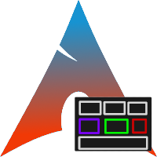
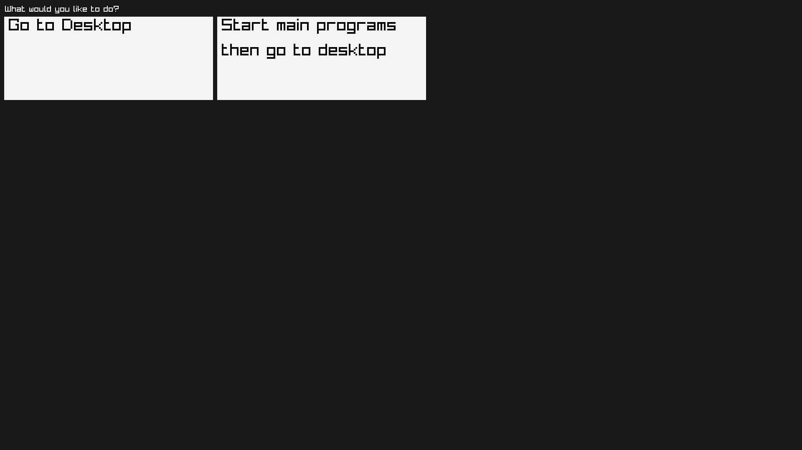
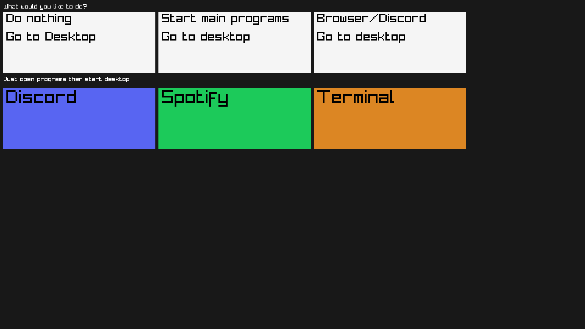

 

# MASS

## **M**essy **A**rch **S**tart **S**creen

This programs boots once Messyarch os (Or any Linux based OS) boots into to desktop, it will ask what to do and start things for you, 

it is still in pre development and still needs a lot of work

# version history

these photos are the list of what all the versions look like..

## version 1

## version 2

